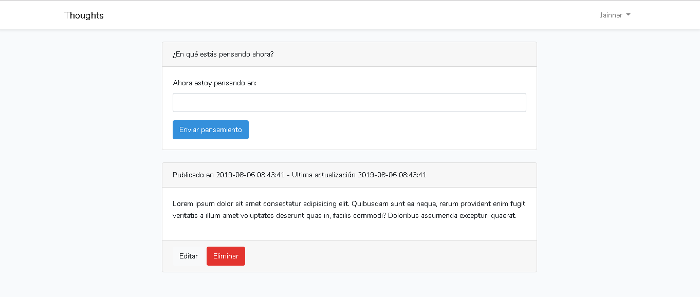

# Simple CRUD usando Laravel y VueJS
_usando Vue Componentes, Laravel Mix (Webpack), Axios, y NPM._

## Construido con 🛠️

_Herramientas utilizadas para crear el proyecto_

* [VueJS](https://vuejs.org/v2/guide/components.html) - El framework front end
* [Laravel](https://vuejs.org/v2/guide/components.html) - El framework back end
* [Laravel Mix (Webpack)](https://maven.apache.org/) - Compilación de activos
* [Axios](https://rometools.github.io/rome/) - Solicitudes HTTP